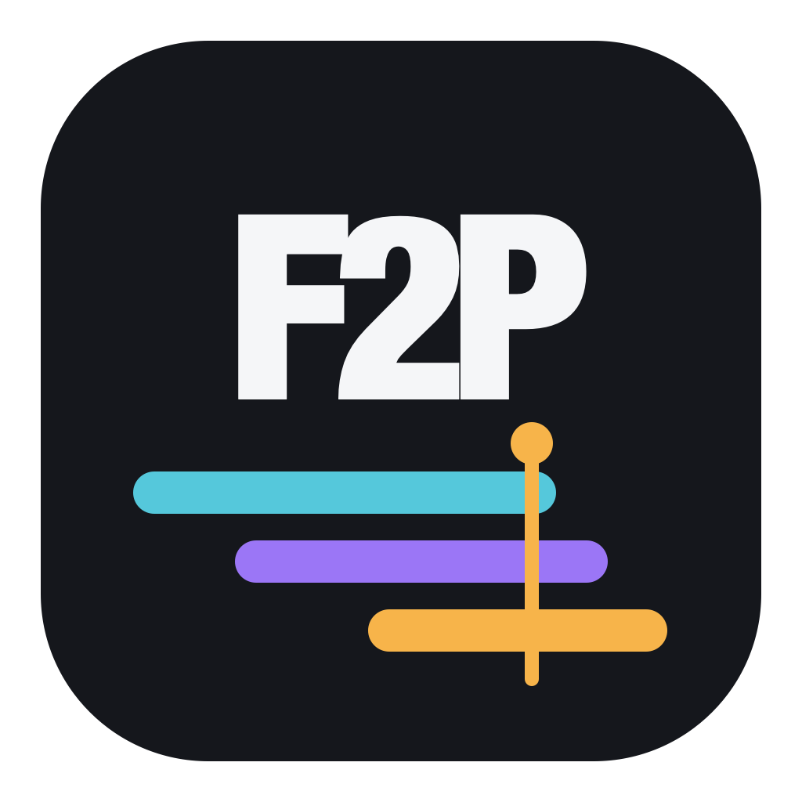
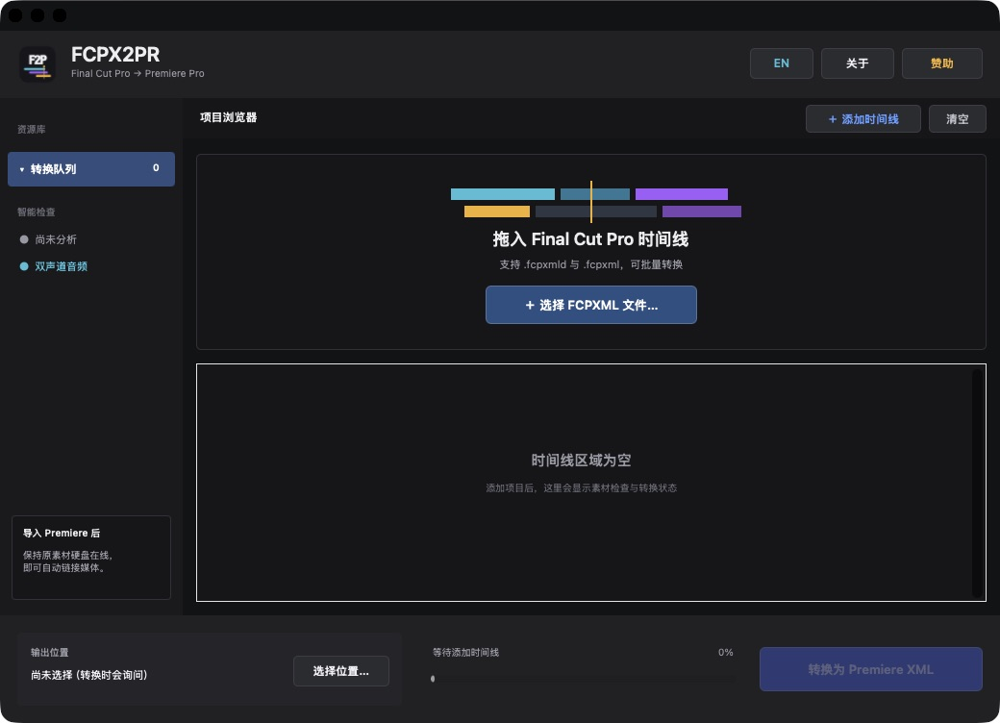
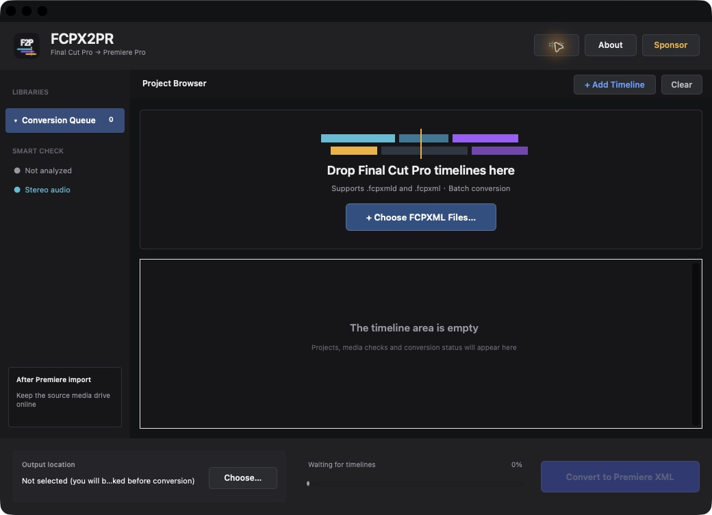

  
  <h1>FCPX2PR</h1>
  
Final Cut Pro → Adobe Premiere Pro 时间线转换工具

  
Final Cut Pro → Adobe Premiere Pro Timeline Converter

  <a href="#简体中文">简体中文</a> · <a href="#english">English</a>

> 当前版本 / Current version: **1.0**  
> 作者 / Author: **ameng**  
> 系统 / System: **macOS 12 或更高版本 / macOS 12 or later**

---

## 简体中文

FCPX2PR 是一款免费的 macOS 工具，用来把 Final Cut Pro 导出的 `.fcpxmld` 时间线包或 `.fcpxml` 文件转换为 Adobe Premiere Pro 可导入的 XML。它重点保留剪辑时间点、素材引用和实拍素材的源音频，适合需要从 Final Cut Pro 转到 Premiere Pro 继续剪辑的项目。

### 功能特点

- 支持 `.fcpxmld` 与 `.fcpxml`
- 保留剪辑点、时间线位置和素材入出点
- 保留源素材音频，并按双声道方式写入 Premiere XML
- 支持一次添加多个时间线批量转换
- 转换前检查素材路径，减少离线素材
- 可自由选择输出目录，并显示转换进度
- 支持简体中文与英文界面切换
- 支持 Apple 芯片和 Intel 芯片 Mac

### 下载与安装

1. 前往 [最新版本下载页面](../../releases/latest)，下载 `FCPX2PR-1.0.dmg`。
2. 打开 DMG，把 FCPX2PR 拖到“应用程序”文件夹。
3. 第一次打开时，如果 macOS 提示无法验证开发者，请在“应用程序”中右键点击 FCPX2PR，选择“打开”，然后再次确认。

### 使用方法

1. 在 Final Cut Pro 中导出 FCPXML 时间线。
2. 把 `.fcpxmld` 或 `.fcpxml` 拖入 FCPX2PR，也可以点击“选择 FCPXML 文件…”。
3. 点击“选择位置…”设置保存目录；如果未提前选择，开始转换时软件会询问保存位置。
4. 点击“转换为 Premiere XML”，等待进度达到 100%。
5. 点击“在访达中显示”，然后在 Adobe Premiere Pro 中选择“文件 > 导入”并打开生成的 XML。

详细步骤请查看：[完整使用说明](docs/使用说明-User-Guide.md)

### 重要提示

- 转换和导入期间，请保持原素材硬盘连接，并保持硬盘名称、文件夹和素材路径不变。
- Final Cut Pro 专属的调色、LUT、语音隔离、部分转场和第三方插件效果，可能需要在 Premiere Pro 中重新添加。
- 本仓库用于提供 FCPX2PR 的安装包和使用文档；软件可免费使用。

### 自愿赞助

FCPX2PR 免费使用。如果它节省了你的剪辑时间，可以在软件中打开“赞助”窗口扫码支持作者；赞助完全自愿，不会影响任何功能。

---

## English

FCPX2PR is a free macOS utility that converts Final Cut Pro `.fcpxmld` timeline packages and `.fcpxml` files into XML files that Adobe Premiere Pro can import. It focuses on preserving edit points, media references, and source audio from recorded footage for projects moving from Final Cut Pro to Premiere Pro.

### Features

- Supports `.fcpxmld` and `.fcpxml`
- Preserves edit points, timeline positions, and media in/out points
- Preserves source audio and writes stereo channels into Premiere XML
- Converts multiple timelines in one batch
- Checks media paths before conversion to reduce offline media
- Lets you choose the output folder and shows conversion progress
- Switches between Simplified Chinese and English
- Supports both Apple silicon and Intel Macs

### Download and installation

1. Open the [latest release page](../../releases/latest) and download `FCPX2PR-1.0.dmg`.
2. Open the DMG and drag FCPX2PR into the Applications folder.
3. If macOS cannot verify the developer on first launch, right-click FCPX2PR in Applications, choose **Open**, then confirm.

### How to use

1. Export an FCPXML timeline from Final Cut Pro.
2. Drop a `.fcpxmld` package or `.fcpxml` file into FCPX2PR, or click **Choose FCPXML Files…**.
3. Click **Choose…** to select an output folder. If none is selected, FCPX2PR asks when conversion begins.
4. Click **Convert to Premiere XML** and wait for progress to reach 100%.
5. Click **Show in Finder**, then choose **File > Import** in Adobe Premiere Pro and open the generated XML.

For detailed instructions, see the [complete user guide](docs/使用说明-User-Guide.md).

### Important notes

- Keep the source media drive connected during conversion and import. Do not change its volume name, folder structure, or media paths.
- Color grades, LUTs, Voice Isolation, some transitions, and third-party effects unique to Final Cut Pro may need to be recreated in Premiere Pro.
- This repository provides the FCPX2PR installer and documentation. The app is free to use.

### Optional sponsorship

FCPX2PR is free. If it saves you editing time, you can open **Sponsor** inside the app and scan the WeChat code to support the author. Sponsorship is optional and never changes available features.

